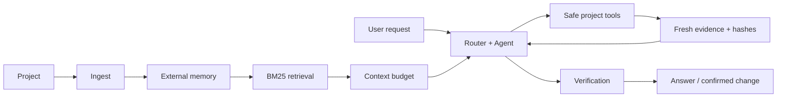

<p align="center">
  
</p>

<p align="center">
  <strong>Local-first coding agent for local LLMs.</strong><br>
  External memory, selective BM25 retrieval, grounded evidence, safe patches, tests, and rollback.
</p>

<p align="center">
  <a href="README.pt-BR.md">Português</a> ·
  <a href="docs/architecture.md">Architecture</a> ·
  <a href="docs/configuration.md">Configuration</a> ·
  <a href="docs/benchmark.md">Benchmark</a> ·
  <a href="SECURITY.md">Security</a>
</p>

<p align="center">
  
  
  
  
  
  
</p>

> [!IMPORTANT]
> **Minimum recommended model:** [LiquidAI/LFM2.5-8B-A1B](https://huggingface.co/LiquidAI/LFM2.5-8B-A1B), or a compatible quantized derivative.
> Eyle ships with **supervised agent mode enabled** for projects inside `workspace/`: it can read, search, propose, patch, and run isolated tests, but every real write still requires explicit user confirmation.

## What is Eyle?

Eyle is a privacy-oriented coding assistant that runs against a **local language
model**. Instead of sending an entire repository to the model, Eyle builds an
external project memory and retrieves only the evidence needed for each step.

The model can inspect, explain, and propose changes. Deterministic project code
owns the dangerous parts: path validation, fresh reads, hashes, dry runs,
confirmation, atomic writes, tests, final rereads, and rollback.

### Highlights

- **Local model support** — works with OpenAI-compatible local servers, LM
  Studio, llama.cpp server, and Ollama-style backends.
- **External project memory** — repositories larger than the model context can
  be indexed and queried incrementally.
- **Offline BM25 retrieval** — no vector database or cloud embedding service is
  required.
- **Evidence-grounded answers** — source ranges and hashes are kept outside the
  model's short observation buffer.
- **Supervised agent workflow** — enabled by default for `workspace/`; every write requires explicit confirmation, fresh hashes, a dry run, isolated tests, and rollback support.
- **Persistent operation** — optional Flask interface, SQLite job queue,
  checkpoints, conversation history, backups, and retention controls.

## Architecture



The model sees the user's original language. Internal agent instructions, tool
contracts, state messages, and canonical structured output are in English for
higher tool-calling reliability. Eyle replies in the user's language.

Read the full design in [docs/architecture.md](docs/architecture.md).

## Quick start

### 1. Clone and prepare Python

```bash
git clone https://github.com/YOUR_USERNAME/eyle.git
cd eyle
python -m venv .venv
```

Activate the environment:

```bash
# Linux/macOS
source .venv/bin/activate

# Windows PowerShell
.venv\Scripts\Activate.ps1
```

The CLI core uses only the Python standard library. Install the locked runtime
requirements when you want the web interface:

```bash
python -m pip install -r requirements.lock
```

For development and tests:

```bash
python -m pip install -r requirements-dev.lock
```

### 2. Start a local model server

The minimum recommended model for supervised agent use is **LFM2.5-8B-A1B**. Compatible quantizations can be used, but benchmark the exact build you run. Smaller models may still work for read-only inspection, but are not the supported baseline for editing.

Configure your local server in `config.json`. The checked-in default expects an
OpenAI-compatible endpoint at `http://localhost:8080` and automatically selects
the only loaded model when possible.

```json
{
  "llm": {
    "base_url": "http://localhost:8080",
    "model": "auto",
    "openai_compatible": true,
    "max_tokens": 1500,
    "context_window_tokens": 8192
  }
}
```

More options: [docs/configuration.md](docs/configuration.md).

### 3. Add and index a project

Copy a repository into `workspace/`:

```bash
cp -r /path/to/your/project workspace/
python main.py ingest
```

Or index an external directory directly:

```bash
python main.py ingest /path/to/your/project --nome "MyProject"
```

### 4. Ask questions or run the agent

```bash
python main.py perguntar "Where is authentication validated?"
python main.py agente "Inspect the upload limit and propose a safe fix"
python main.py status
```

### 5. Optional web interface

```bash
python main.py serve
```

Open `http://127.0.0.1:5000`. Eyle prints the API token at startup.

## Agent rollout modes

| Mode | Behavior |
|---|---|
| `off` | Uses the earlier non-agent pipelines. |
| `read_only` | Reads, searches, analyzes, and suggests. Blocks writes and execution. |
| `full` | Enables confirmed edits and isolated test execution only for configured trusted paths. **Default profile for `workspace/`.** |

A full edit follows this guarded cycle:

```text
fresh read → exact range → hashes → dry run → confirmation
→ atomic patch → sandboxed tests → final reread or rollback
```

The checked-in configuration enables `full` only for the repository-local `workspace/` directory. External projects automatically fall back to `read_only` until their paths are explicitly trusted. Every write still pauses for confirmation.

Run the real benchmark with the exact model and quantization used on the target machine before adding external trusted paths.

## Benchmark

```bash
python main.py benchmark
```

The ten controlled scenarios evaluate reading, grounding, false success,
unauthorized writes, confirmation, hashes, dry runs, rollback, and post-write
rereads. See [docs/benchmark.md](docs/benchmark.md).

## Repository structure

```text
engine/      Agent orchestration, tools, state, patching, sandbox and queue
llm/         Local model execution and prompt cache
retrieval/   Offline BM25 search
verify/      Grounding and answer verification
tests/       Unit and regression tests
web/         Authenticated Flask interface
workspace/   Local projects to inspect (Git-ignored)
memory/      Indexed external memory (Git-ignored)
context/     Cache, traces, queue, confirmations and backups (Git-ignored)
docs/        Architecture, configuration, benchmark and project history
```

## Safety notes

Eyle is designed to fail closed, but a local agent is still software that can
process untrusted text and source code. Keep external projects in `read_only`, review every proposed patch, use least-privilege operating-system accounts, and never expose the development Flask server directly to the public internet.

Read [SECURITY.md](SECURITY.md) before trusting external paths or exposing the web interface.

## Development

```bash
make dev
make test
```

Or without Make:

```bash
python -m pip install -r requirements-dev.lock
python -m pytest -q
```

Contributions are documented in [CONTRIBUTING.md](CONTRIBUTING.md).

## Current status

- Release: **2.7.0**
- Non-web automated tests in the release environment: **167/167**
- Minimum recommended model: **LFM2.5-8B-A1B** or compatible quantization
- Default rollout: **supervised agent mode for `workspace/`**
- External paths: **read-only until explicitly trusted**
- Real local-model benchmark: must be executed on the machine hosting the model

## License

No open-source license has been selected yet. The repository is currently
**all rights reserved**. See [LICENSE.md](LICENSE.md) before redistributing or
building a public contributor community.
