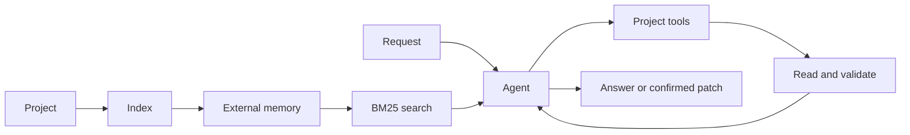

<p align="center">
  
</p>

<p align="center">
  <strong>A local assistant for understanding, changing, and testing code with an LLM running on your machine.</strong>
</p>

<p align="center">
  <a href="README.pt-BR.md">Português</a> ·
  <a href="docs/architecture.md">Architecture</a> ·
  <a href="docs/configuration.md">Configuration</a> ·
  <a href="docs/benchmark.md">Benchmark</a> ·
  <a href="SECURITY.md">Security</a>
</p>

<p align="center">
  
  
  
  
  
  
</p>

## Overview

Eyle indexes a local project, retrieves only relevant code, and uses that evidence to answer questions or prepare changes. The model drives the investigation while deterministic code validates sensitive operations.

| | |
|---|---|
| **Minimum recommended model** | [LFM2.5-8B-A1B](https://huggingface.co/LiquidAI/LFM2.5-8B-A1B) or a compatible quantization |
| **Default mode** | Supervised agent for projects inside `workspace/` |
| **Writes** | Require explicit confirmation before application |
| **Privacy** | Project files, indexes, and history remain on the local machine |

### Features

- Local models through OpenAI-compatible servers, LM Studio, llama.cpp, and Ollama-style backends.
- Persistent external memory for repositories larger than the model context.
- Offline BM25 search without cloud embeddings or a vector database.
- Answers tied to files and ranges read from the project.
- Atomic patches, isolated tests, and rollback.
- CLI, optional Flask interface, SQLite queue, checkpoints, and retention.

## How it works



See [architecture](docs/architecture.md) for the full design.

## Quick installation

```bash
git clone https://github.com/YOUR_USERNAME/eyle.git
cd eyle
python -m venv .venv
```

Activate the environment:

```bash
# Linux/macOS
source .venv/bin/activate

# Windows PowerShell
.venv\Scripts\Activate.ps1
```

Install the dependencies you need:

```bash
# Web interface
python -m pip install -r requirements.lock

# Development and tests
python -m pip install -r requirements-dev.lock
```

## Configuration

Start a local LLM through an OpenAI-compatible endpoint. The default configuration uses `http://localhost:8080` and automatically selects the only loaded model.

```json
{
  "llm": {
    "base_url": "http://localhost:8080",
    "model": "auto",
    "openai_compatible": true,
    "max_tokens": 1500,
    "context_window_tokens": 8192
  }
}
```

See [docs/configuration.md](docs/configuration.md) for all options.

## Usage

Copy a project into `workspace/` and index it:

```bash
cp -r /path/to/project workspace/
python main.py ingest
```

Then ask questions or run the agent:

```bash
python main.py perguntar "Where is authentication validated?"
python main.py agente "Inspect the upload limit and propose a safe fix"
python main.py status
```

Optional web interface:

```bash
python main.py serve
```

Open `http://127.0.0.1:5000`. The API token is printed at startup.

## Agent modes

| Mode | Permissions |
|---|---|
| `off` | Uses the earlier pipelines without automatic agent routing. |
| `read_only` | Allows reading, searching, analysis, and suggestions. |
| `full` | Allows confirmed changes and isolated tests in trusted paths. |

The default configuration trusts only `workspace/`. External directories remain `read_only` until added to `trusted_project_paths`.

## Validation

```bash
python main.py benchmark
python -m pytest -q
```

The benchmark covers reading, grounding, tool use, and the edit workflow. Run it with the exact model and quantization used in the target environment. See [docs/benchmark.md](docs/benchmark.md).

## Repository structure

```text
engine/      Agent, tools, state, patches, sandbox, and queue
llm/         Local model execution and prompt cache
retrieval/   Offline BM25 search
verify/      Answer verification
web/         Authenticated Flask interface
tests/       Unit and regression tests
workspace/   Projects under analysis — Git-ignored
memory/      Generated index — Git-ignored
context/     Cache, traces, and backups — Git-ignored
docs/        Technical documentation and history
```

## Current status

- Release: **2.7.0**
- Non-web automated tests: **167/167** in the release environment
- The real-model benchmark must be run on the machine hosting the LLM

## License

The repository is currently **all rights reserved**. Read [LICENSE.md](LICENSE.md) before copying, redistributing, or opening the project to public contributions.
