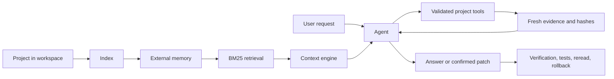

<p align="center">
  
</p>

<p align="center">
  <strong>A local-first supervised coding agent with external memory, BM25 retrieval, guarded edits, tests, rollback, and cycle protection.</strong>
</p>

<p align="center">
  <a href="README.pt-BR.md">Português</a> ·
  <a href="docs/architecture.md">Architecture</a> ·
  <a href="docs/configuration.md">Configuration</a> ·
  <a href="docs/benchmark.md">Benchmark</a> ·
  <a href="CHANGELOG.md">Changelog</a> ·
  <a href="SECURITY.md">Security</a>
</p>

<p align="center">
  
  
  
  
  
</p>

## Overview

Eyle indexes a local repository, retrieves only relevant evidence, and uses a local LLM to answer questions or prepare guarded changes. The model proposes actions; deterministic code controls permissions, evidence freshness, confirmation, atomic writes, tests, rollback, deadlines, and completion.

| | |
|---|---|
| **Release** | 2.7.3 |
| **Default rollout** | `read_only` until the real-model benchmark is validated locally |
| **Recommended model target** | LFM2.5-8B-A1B or a compatible quantization |
| **Privacy** | Source code, indexes, traces, queue, and history remain on the local machine |
| **Mutable state** | `workspace/`, `memory/`, and `context/` are ignored by Git |


### Main capabilities

- Local models through OpenAI-compatible servers, LM Studio, llama.cpp, and Ollama-style backends.
- Persistent external memory for projects larger than the model context window.
- Offline inverted-index BM25 retrieval with a bounded query LRU, without cloud embeddings or a vector database.
- Grounded answers tied to fresh files, ranges, hashes, and evidence IDs.
- Schema-validated tools and explicit `READ`, `EXEC`, and `WRITE` permissions.
- Atomic patching, explicit confirmation, isolated tests, final reread, and rollback.
- Shared deadlines, differentiated timeouts, retry backoff, rate limiting, and telemetry.
- Short-cycle detection for repeated agent states and bounded queue reservation.
- CLI, optional authenticated Flask interface, SQLite queue, checkpoints, and retention.

## How it works



See [architecture](docs/architecture.md) for the full design.

## Quick installation

```bash
git clone https://github.com/rafaelzaydh-jpg/eyle.git
cd eyle
python -m venv .venv
```

Activate the environment:

```bash
# Linux/macOS
source .venv/bin/activate

# Windows PowerShell
.venv\Scripts\Activate.ps1
```

Install dependencies:

```bash
# Web interface
python -m pip install -r requirements.lock

# Development and complete test environment
python -m pip install -r requirements-dev.lock
```

## Configuration

The release defaults to a local OpenAI-compatible endpoint and automatic model discovery:

```json
{
  "llm": {
    "base_url": "http://127.0.0.1:8080",
    "model": "auto",
    "openai_compatible": true,
    "max_tokens": 1500,
    "context_window_tokens": 8192
  },
  "agent": {
    "rollout_mode": "read_only",
    "trusted_project_paths": []
  }
}
```

Keep `read_only` while validating the real model. To enable supervised editing, use `rollout_mode: "full"`, explicitly trust the intended project root, and review the write/test policy first. See [docs/configuration.md](docs/configuration.md).

## Usage

Copy a project into `workspace/` and index it:

```bash
cp -r /path/to/project workspace/
python main.py ingest
```

Then ask questions or run the agent:

```bash
python main.py perguntar "Where is authentication validated?"
python main.py agente "Inspect the upload limit and propose a safe fix"
python main.py status
```

Optional web interface:

```bash
python main.py serve
```

Open `http://127.0.0.1:5000`. The API token is printed at startup.

## Agent rollout modes

| Mode | Permissions |
|---|---|
| `off` | Uses the earlier pipelines without automatic agent routing. |
| `read_only` | Allows reading, retrieval, analysis, and suggestions; blocks execution and writes. |
| `full` | Allows the guarded edit cycle only for explicitly trusted project paths. |

A real write still requires fresh evidence, exact ranges, hashes, dry run, explicit confirmation, atomic application, configured tests, and a final reread.

## Validation

```bash
python engine/release_identity.py
python -m compileall -q .
python -m pytest -q
python main.py benchmark
```

Release validation in the packaging environment:

- **218/218 executable non-web tests passed**;
- **1 web test module was skipped** because Flask was not installed there;
- the real-model benchmark remains environment-specific and must be run with the actual endpoint, model, quantization, hardware, and target repository.

See [docs/benchmark.md](docs/benchmark.md).

## Repository structure

```text
engine/      Agent, tools, grounding, state, patching, telemetry, worker, and queue
llm/         Local model execution, retries, rate limiting, model detection, and cache
retrieval/   Offline BM25 retrieval
verify/      Answer and citation verification
web/         Authenticated Flask interface
tests/       Unit and regression tests
workspace/   Projects under analysis — Git-ignored
memory/      Generated external memory — Git-ignored
context/     Cache, queue, traces, telemetry, and backups — Git-ignored
docs/        Architecture, configuration, benchmark, releases, and history
```

## Documentation

- [Architecture](docs/architecture.md)
- [Configuration](docs/configuration.md)
- [Benchmark and validation](docs/benchmark.md)
- [Upgrading and publishing](docs/github-publishing.md)
- [Detailed technical overview](docs/technical-overview.md)

## License

The repository is currently **all rights reserved**. Read [LICENSE.md](LICENSE.md) before copying, redistributing, or opening the project to unrestricted public reuse.
