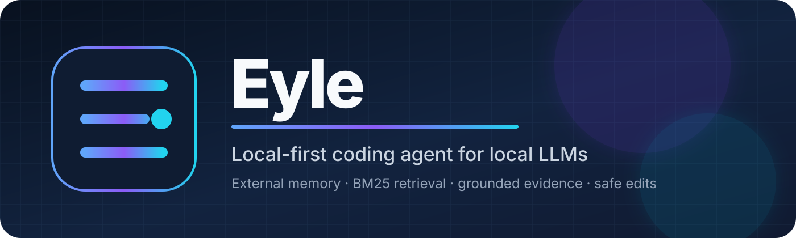

<p align="center"></p>
<p align="center"><strong>Um cérebro LLM. Ferramentas reais. Escrita supervisionada. Execução observável.</strong></p>

**Versão:** 2.7.4 · **Schema:** 4.12.2 · **Revisão:** 4.12.2-context-runner-hardening

A Eyle é uma agente local de programação construída em torno de uma ideia simples: a LLM decide o que fazer, ferramentas determinísticas medem e executam a realidade, e o runtime protege apenas os limites que não podem depender de adivinhação.

## Por que a Eyle existe

Ela foi pensada para repositórios reais, inclusive projetos grandes demais para caber em um único prompt. A Eyle não despeja o projeto inteiro no contexto e não usa um comitê de agentes. Ela investiga somente o necessário para a tarefa, preserva as evidências úteis e consegue alterar vários arquivos numa única transação supervisionada.

```text
usuário
→ AgentSession
→ decisão da LLM
↔ ferramentas determinísticas / workspace real / memória externa sob demanda
→ dry-run + confirmação para escrita
→ compile/testes/releitura/rollback
→ resposta
```

## Rev4.12.2: contexto + robustez do executor de testes

A Rev4.12.2 preserva as tools e o histórico expansível da Rev4.12.1 e corrige duas falhas encontradas em testes reais com projeto grande: resultados estruturados de tools estourando o prompt seguinte e `run_tests` disponível enquanto `pytest` ainda era apenas dependência de desenvolvimento. Cada resposta da Eyle ligada a um job pode mostrar um botão **histórico** na interface web. O conteúdo só é buscado quando você abre a aba, portanto não aumenta o polling normal.

O histórico mostra fatos observáveis do runtime:

- turnos do agente e fase final;
- quantidade de chamadas LLM, latência e motivo de término;
- tokens de prompt, cacheados, novos/não cacheados, saída e total efetivo;
- tipo de decisão por turno, incluindo aceitação/rejeição e motivo de validação;
- ferramentas chamadas, argumentos observáveis e resultado resumido;
- `compileall`, testes, releituras e rollback após escrita;
- códigos de falha quando a tarefa para.

Ele **não mostra** chain-of-thought, prompt bruto, resposta bruta do modelo, conteúdo dos arquivos-fonte, hashes ou corpo da memória externa.

## Raciocínio assistido por ferramentas

A LLM não precisa fazer tudo “de cabeça”. A Eyle pode usar:

- `calculate` — cálculo decimal determinístico;
- `project_stats` — arquivos, linhas, caracteres, bytes e linguagens;
- `count_tokens` — tamanho medido com indicação explícita de contagem exata ou heurística;
- `inspect_project` — sinais objetivos de entrypoints, imports, rotas, testes, CI e frameworks, sem declarar qual arquivo é “importante”;
- `search_code`, `read_file`, `read_range`, `find_symbol`, `list_tree` — inspeção do workspace real;
- `agent_info` — identidade atual e ferramentas realmente disponíveis;
- `run_tests` — execução real em sandbox, com escopo pytest opcional e saída diagnóstica limitada;
- `git_status` — estado do working tree em modo somente leitura;
- `git_diff` — diff somente leitura com tamanho limitado;
- memória externa somente quando a própria LLM decide consultar ou armazenar algo.

A ferramenta observa. A Eyle interpreta a observação conforme a tarefa. Resultados determinísticos como `calculate` viram evidência real, mas a resposta final continua sendo escrita pela LLM para preservar tom, explicação e personalidade.

## Escrita supervisionada

```text
pedido
→ ler o código necessário
→ gerar uma transação
→ dry-run
→ confirmação do usuário
→ aplicar
→ compileall dos Python alterados
→ detectar e executar testes
→ rollback se compile/testes/releitura falharem
→ reler e confirmar a saída real
→ informar honestamente se foi verificado ou parcialmente validado
```

Tarefas comuns de escrita usam fases. Depois do orçamento de investigação, leituras são fechadas e o próximo turno fica reservado ao patch. Leituras equivalentes também são bloqueadas quando já existe evidência fresca.

## Qualidade factual

Fatos sobre o projeto, bugs confirmados e riscos contextuais precisam nascer de observações reais. O runtime mantém um ledger compacto entre afirmações e evidências e aplica limites explícitos como “até 3”. As claims apontam para o número da frase visível, sem repetir o texto completo dentro do protocolo.

## Estrutura

```text
eyle/core/       AgentSession, tools, inspeção, memória e edição segura
eyle/runtime/    serviço, fila, worker, persistência, telemetria e histórico público
llm/             transporte, normalização e contabilidade de tokens
web/             chat Flask e histórico expansível
docs/            arquitetura, configuração, releases e notas de engenharia
```

## Uso

```bash
python main.py status
python main.py perguntar "Analise o projeto"
python main.py serve
```

Os endpoints de dados da interface usam Bearer token. O comando `serve` informa no terminal onde obter o token local da API.

## Validação

- 162 testes passam na suíte determinística empacotada;
- 1 teste opcional da interface é pulado quando Flask não está instalado no ambiente de empacotamento;
- o smoke real com Qwen continua sendo executado apenas no ambiente de deploy.

## Licença

A Eyle tem o **código-fonte disponível, mas não é software open source**. A licença permite que pessoas baixem, instalem, executem e modifiquem a Eyle de forma privada para uso pessoal e não comercial. Redistribuição, publicação de cópias ou versões modificadas, venda, sublicenciamento, uso comercial e oferta da Eyle como serviço exigem autorização prévia por escrito.

Consulte [LICENSE.md](LICENSE.md) para os termos que regem o software e [CONTRIBUTING.md](CONTRIBUTING.md) para os termos de contribuição. Os direitos limitados decorrentes do próprio uso do GitHub continuam sujeitos aos Termos de Serviço do GitHub.

## Documentação

- [Arquitetura](docs/architecture.md)
- [Visão técnica](docs/technical-overview.md)
- [Configuração](docs/configuration.md)
- [Benchmark](docs/benchmark.md)
- [Notas da Rev4.12.2](docs/releases/2.7.4-rev4.12.2.md)
- [Histórico de decisões removidas](UPDATE_HISTORY.md)
- [Changelog](CHANGELOG.md)
