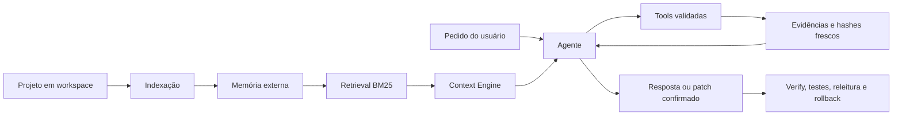

<p align="center">
  
</p>

<p align="center">
  <strong>Agente local supervisionado para código, com memória externa, retrieval BM25, edições protegidas, testes, rollback e proteção contra ciclos.</strong>
</p>

<p align="center">
  <a href="README.md">English</a> ·
  <a href="docs/architecture.md">Arquitetura</a> ·
  <a href="docs/configuration.md">Configuração</a> ·
  <a href="docs/benchmark.md">Benchmark</a> ·
  <a href="CHANGELOG.md">Histórico</a> ·
  <a href="SECURITY.md">Segurança</a>
</p>

<p align="center">
  
  
  
  
  
</p>

**Versão:** 2.7.3 · **Schema:** 2.7.3 · **Revisão:** 55.22-project-read-orchestration-and-benchmark-truth

## Visão geral

A Eyle indexa um repositório local, recupera apenas as evidências relevantes e usa uma LLM local para responder perguntas ou preparar alterações protegidas. O modelo propõe ações; o código determinístico controla permissões, validade das evidências, confirmação, escrita atômica, testes, rollback, prazos e conclusão.

| | |
|---|---|
| **Versão** | 2.7.3 |
| **Rollout padrão** | `read_only` até o benchmark real ser validado localmente |
| **Modelo-alvo recomendado** | LFM2.5-8B-A1B ou quantização compatível |
| **Privacidade** | Código, índices, traces, fila e histórico permanecem na máquina local |
| **Estado mutável** | `workspace/`, `memory/` e `context/` são ignorados pelo Git |


### Recursos principais

- Modelos locais via servidores compatíveis com OpenAI, LM Studio, llama.cpp e backends no estilo Ollama.
- Memória externa persistente para projetos maiores que a janela de contexto.
- Retrieval BM25 com índice invertido e cache LRU de consultas, sem embeddings em nuvem ou banco vetorial.
- Grounding tipado: fatos observados exigem evidência, enquanto inferências, hipóteses, decisões e recomendações mantêm a liberdade adequada.
- Normalização unificada de respostas com `content`, `reasoning_content`, streaming, JSON parcial e texto puro.
- Gate de utilidade e recuperação em camadas impedem resposta vazia ou recibo técnico de virar sucesso.
- Um único Evidence Registry alimenta leitura, análise, grounding, conclusão e resumo público.
- Um inventário estruturado completo do projeto sobrevive aos resumos de 500 caracteres e permanece visível em todas as decisões seguintes do Agente.
- Auditorias gerais usam um catálogo determinístico de candidatos por função antes da seleção do modelo.
- Um Scout dedicado escolhe componentes válidos, o sistema os lê automaticamente, um Scout de lacunas recebe código fresco e um Finalizer sem ferramentas produz a conclusão grounded.
- O Finalizer de auditoria emite claims atômicas estruturadas; a Eyle valida evidências por claim, renderiza o texto final deterministicamente e bloqueia declarações globais de saúde ou status de testes sem prova.
- A memória indexada do projeto é marcada como pista de navegação não confiável, salvo quando o hash persistido ainda corresponde ao disco; conclusões de auditoria continuam exigindo Evidence IDs frescos.
- Toda auditoria de projeto publica métricas determinísticas de cobertura real: inventário completo, arquivos de código lidos, componentes críticos revisados, execução atual de testes, documentos realmente usados e nível `none`/`partial`/`targeted`/`complete`.
- O sistema adiciona uma declaração honesta de cobertura após o grounding e sempre informa que a auditoria não garante ausência universal de bugs.
- `project_read` agora separa a coleta de evidências de um Finalizer dedicado de 1.400 tokens, evitando que o planejamento de ferramentas dispute espaço com a resposta final.
- Metadados do provider (`finish_reason`, modelo resolvido, uso e tokens de raciocínio) são preservados; truncamento por limite repete uma vez com orçamento maior e depois falha fechado.
- Consultas exatas sobre existência de símbolos usam `find_symbol` deterministicamente, enquanto escritas confirmadas avançam automaticamente por testes e releitura fresca.
- O benchmark v2 separa factualidade, completude, grounding, workflow, segurança, latência por chamada LLM e modelo realmente resolvido.
- Tools validadas por schema e permissões explícitas `READ`, `EXEC` e `WRITE`.
- Patches atômicos, confirmação explícita, testes isolados, releitura final e rollback.
- Deadline compartilhado, timeouts separados, backoff, rate limiting e telemetria.
- Detecção de ciclos curtos e reserva de fila com limite.
- CLI, painel Flask autenticado opcional, fila SQLite, checkpoints e retenção.

## Como funciona



Detalhes em [arquitetura](docs/architecture.md).

## Instalação rápida

```bash
git clone https://github.com/rafaelzaydh-jpg/eyle.git
cd eyle
python -m venv .venv
```

Ative o ambiente:

```bash
# Linux/macOS
source .venv/bin/activate

# Windows PowerShell
.venv\Scripts\Activate.ps1
```

Instale as dependências:

```bash
# Painel web
python -m pip install -r requirements.lock

# Desenvolvimento e ambiente completo de testes
python -m pip install -r requirements-dev.lock
```

## Configuração

A release usa por padrão um endpoint local compatível com OpenAI e descoberta automática do modelo:

```json
{
  "llm": {
    "base_url": "http://127.0.0.1:8080",
    "model": "auto",
    "openai_compatible": true,
    "max_tokens": 1500,
    "context_window_tokens": 8192
  },
  "agent": {
    "rollout_mode": "read_only",
    "trusted_project_paths": []
  }
}
```

Mantenha `read_only` enquanto valida o modelo real. Para liberar edição supervisionada, use `rollout_mode: "full"`, confie explicitamente na raiz correta e revise antes a política de escrita/testes. Veja [docs/configuration.md](docs/configuration.md).

## Uso

Coloque um projeto em `workspace/` e indexe:

```bash
cp -r /caminho/do/projeto workspace/
python main.py ingest
```

Depois consulte ou execute o Agente:

```bash
python main.py perguntar "Onde a autenticação é validada?"
python main.py agente "Analise o limite de upload e proponha uma correção segura"
python main.py status
```

Painel web opcional:

```bash
python main.py serve
```

Abra `http://127.0.0.1:5000`. O token aparece no terminal e, quando gerado automaticamente, também fica em `context/web_api_token.txt`. O botão **token** permite informar outro valor sem recarregar a página.

## Modos de rollout

| Modo | Permissões |
|---|---|
| `off` | Usa os pipelines anteriores, sem roteamento automático para o Agente. |
| `read_only` | Permite leitura, retrieval, análise e sugestões; bloqueia execução e escrita. |
| `full` | Libera o ciclo protegido de edição apenas para caminhos explicitamente confiáveis. |

Uma escrita real ainda exige evidência fresca, faixa exata, hashes, dry run, confirmação explícita, aplicação atômica, testes configurados e releitura final.

## Validação

```bash
python engine/release_identity.py
python -m compileall -q .
python -m pytest -q
python main.py benchmark
```

Resultado no ambiente de empacotamento:

- **328/328 testes executáveis aprovados**;
- **1 módulo web ignorado** porque o Flask não estava instalado naquele ambiente;
- o benchmark com modelo real depende do endpoint, modelo, quantização, hardware e repositório usados na instalação final.

Veja [docs/benchmark.md](docs/benchmark.md).

## Estrutura do repositório

```text
engine/      Agente, tools, grounding, estado, patches, telemetria, worker e fila
llm/         Execução local, retries, rate limiting, detecção de modelo e cache
retrieval/   Retrieval BM25 offline
verify/      Verificação de resposta e citações
web/         Painel Flask autenticado
tests/       Testes unitários e regressões
workspace/   Projetos analisados — ignorado pelo Git
memory/      Memória externa gerada — ignorada pelo Git
context/     Cache, fila, traces, telemetria e backups — ignorados pelo Git
docs/        Arquitetura, configuração, benchmark, releases e histórico
```

## Documentação

- [Arquitetura](docs/architecture.md)
- [Configuração](docs/configuration.md)
- [Benchmark e validação](docs/benchmark.md)
- [Atualização e publicação](docs/github-publishing.md)
- [Visão técnica detalhada](docs/technical-overview.md)

## Licença

O repositório está atualmente sob **todos os direitos reservados**. Consulte [LICENSE.md](LICENSE.md) antes de copiar, redistribuir ou abrir o projeto para reutilização pública irrestrita.
