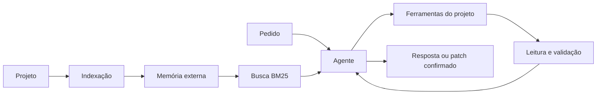

<p align="center">
  
</p>

<p align="center">
  <strong>Assistente local para entender, alterar e testar código com uma LLM executada na sua máquina.</strong>
</p>

<p align="center">
  <a href="README.md">English</a> ·
  <a href="docs/architecture.md">Arquitetura</a> ·
  <a href="docs/configuration.md">Configuração</a> ·
  <a href="docs/benchmark.md">Benchmark</a> ·
  <a href="SECURITY.md">Segurança</a>
</p>

<p align="center">
  
  
  
  
  
  
</p>

## Visão geral

A Eyle indexa um projeto local, recupera apenas os trechos relevantes e usa essas evidências para responder perguntas ou preparar alterações. O modelo conduz a investigação; operações sensíveis são validadas por código determinístico.

| | |
|---|---|
| **Modelo mínimo recomendado** | [LFM2.5-8B-A1B](https://huggingface.co/LiquidAI/LFM2.5-8B-A1B) ou quantização compatível |
| **Modo padrão** | Agente supervisionado em projetos dentro de `workspace/` |
| **Escritas** | Exigem confirmação explícita antes de serem aplicadas |
| **Privacidade** | Projeto, índice e histórico permanecem na máquina local |

### Recursos

- LLMs locais por servidores compatíveis com OpenAI, LM Studio, llama.cpp e backends no estilo Ollama.
- Memória externa persistente para projetos maiores que a janela de contexto.
- Busca BM25 offline, sem embeddings ou banco vetorial na nuvem.
- Respostas ligadas a arquivos e trechos lidos do projeto.
- Patches atômicos, testes isolados e rollback.
- CLI, painel Flask opcional, fila SQLite, checkpoints e retenção.

## Como funciona



Detalhes: [arquitetura](docs/architecture.md).

## Instalação rápida

```bash
git clone https://github.com/SEU_USUARIO/eyle.git
cd eyle
python -m venv .venv
```

Ative o ambiente:

```bash
# Linux/macOS
source .venv/bin/activate

# Windows PowerShell
.venv\Scripts\Activate.ps1
```

Instale as dependências necessárias:

```bash
# Painel web
python -m pip install -r requirements.lock

# Desenvolvimento e testes
python -m pip install -r requirements-dev.lock
```

## Configuração

Inicie uma LLM local em um endpoint compatível com OpenAI. A configuração padrão usa `http://localhost:8080` e seleciona automaticamente o único modelo carregado.

```json
{
  "llm": {
    "base_url": "http://localhost:8080",
    "model": "auto",
    "openai_compatible": true,
    "max_tokens": 1500,
    "context_window_tokens": 8192
  }
}
```

Veja todas as opções em [docs/configuration.md](docs/configuration.md).

## Uso

Coloque um projeto em `workspace/` e faça a indexação:

```bash
cp -r /caminho/do/projeto workspace/
python main.py ingest
```

Depois, consulte ou execute o agente:

```bash
python main.py perguntar "Onde a autenticação é validada?"
python main.py agente "Analise o limite de upload e proponha uma correção segura"
python main.py status
```

Painel web opcional:

```bash
python main.py serve
```

Abra `http://127.0.0.1:5000`. O token da API aparece no terminal.

## Modos do agente

| Modo | Permissões |
|---|---|
| `off` | Usa os pipelines antigos, sem roteamento automático para o agente. |
| `read_only` | Permite leitura, busca, análise e sugestões. |
| `full` | Permite alterações confirmadas e testes isolados em caminhos confiáveis. |

A configuração inicial confia apenas em `workspace/`. Pastas externas entram como `read_only` até serem adicionadas a `trusted_project_paths`.

## Validação

```bash
python main.py benchmark
python -m pytest -q
```

O benchmark exercita leitura, grounding, uso de ferramentas e o fluxo de edição. Execute-o com o modelo e a quantização que serão usados no ambiente real. Saiba mais em [docs/benchmark.md](docs/benchmark.md).

## Estrutura do projeto

```text
engine/      Agente, ferramentas, estado, patches, sandbox e fila
llm/         Execução da LLM local e cache de prompts
retrieval/   Busca BM25 offline
verify/      Verificação das respostas
web/         Painel Flask autenticado
tests/       Testes unitários e regressões
workspace/   Projetos analisados — ignorado pelo Git
memory/      Índice gerado — ignorado pelo Git
context/     Cache, traces e backups — ignorado pelo Git
docs/        Documentação técnica e histórico
```

## Estado atual

- Versão: **2.7.0**
- Testes automatizados não-web: **167/167** no ambiente da release
- O benchmark com a LLM deve ser executado na máquina que hospeda o modelo

## Licença

O repositório está atualmente sob **todos os direitos reservados**. Consulte [LICENSE.md](LICENSE.md) antes de copiar, redistribuir ou criar uma comunidade pública de contribuidores.
