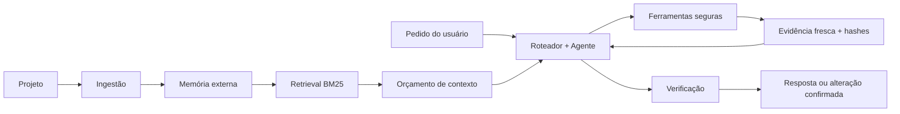

<p align="center">
  
</p>

<p align="center">
  <strong>Agente local para programação com LLMs locais.</strong><br>
  Memória externa, retrieval BM25, evidência verificável, patches seguros, testes e rollback.
</p>

<p align="center">
  <a href="README.md">English</a> ·
  <a href="docs/architecture.md">Arquitetura</a> ·
  <a href="docs/configuration.md">Configuração</a> ·
  <a href="docs/benchmark.md">Benchmark</a> ·
  <a href="SECURITY.md">Segurança</a>
</p>

<p align="center">
  
  
  
  
  
  
</p>

> [!IMPORTANT]
> **Modelo mínimo recomendado:** [LiquidAI/LFM2.5-8B-A1B](https://huggingface.co/LiquidAI/LFM2.5-8B-A1B), ou uma quantização derivada compatível.
> A Eyle vem com o **modo agente supervisionado ativado** para projetos dentro de `workspace/`: ela pode ler, buscar, propor, aplicar patches e rodar testes isolados, mas toda escrita real continua exigindo confirmação explícita do usuário.

## O que é a Eyle?

A Eyle é uma assistente de programação orientada à privacidade que trabalha com
uma **LLM local**. Em vez de jogar o repositório inteiro dentro do contexto do
modelo, ela cria uma memória externa do projeto e recupera somente as evidências
necessárias para cada etapa.

O modelo decide o que investigar e propõe ações. O código determinístico da Eyle
controla o que é perigoso: caminhos, leituras frescas, hashes, dry-run,
confirmação, escrita atômica, testes, releitura final e rollback.

### Principais recursos

- **LLMs locais** por servidores compatíveis com OpenAI, LM Studio, llama.cpp e
  backends no estilo Ollama.
- **Memória externa persistente**, permitindo consultar projetos maiores que a
  janela de contexto.
- **BM25 100% offline**, sem banco vetorial ou serviço de embeddings na nuvem.
- **Respostas grounded**, baseadas em evidências frescas do projeto real.
- **Modo agente supervisionado**, ativo por padrão em `workspace/`, com confirmação obrigatória, hashes frescos, dry-run, testes isolados e rollback.
- **Operação persistente**, com painel Flask, fila SQLite, checkpoints,
  histórico, backups e retenção.

## Como funciona



Você continua falando em português. O pedido original não é traduzido. Somente
as instruções internas do agente, contratos das ferramentas, estados e JSON
canônico ficam em inglês para melhorar a confiabilidade do modelo.

## Começo rápido

### 1. Clone e prepare o Python

```bash
git clone https://github.com/SEU_USUARIO/eyle.git
cd eyle
python -m venv .venv
```

Ative o ambiente:

```bash
# Linux/macOS
source .venv/bin/activate

# Windows PowerShell
.venv\Scripts\Activate.ps1
```

O núcleo da CLI usa apenas a biblioteca padrão. Para o painel web:

```bash
python -m pip install -r requirements.lock
```

Para desenvolvimento e testes:

```bash
python -m pip install -r requirements-dev.lock
```

### 2. Configure a LLM local

O modelo mínimo recomendado para usar o agente supervisionado é o **LFM2.5-8B-A1B**. Quantizações compatíveis podem ser usadas, mas o benchmark deve ser executado com a variante exata. Modelos menores podem funcionar para leitura, porém não são a base recomendada para edição.

O `config.json` atual espera um endpoint compatível com OpenAI em
`http://localhost:8080` e tenta selecionar automaticamente o único modelo
carregado.

```json
{
  "llm": {
    "base_url": "http://localhost:8080",
    "model": "auto",
    "openai_compatible": true,
    "max_tokens": 1500,
    "context_window_tokens": 8192
  }
}
```

### 3. Coloque e indexe um projeto

```bash
cp -r /caminho/do/projeto workspace/
python main.py ingest
```

Ou aponte diretamente para outra pasta:

```bash
python main.py ingest /caminho/do/projeto --nome "MeuProjeto"
```

### 4. Use a Eyle

```bash
python main.py perguntar "Onde a autenticação é validada?"
python main.py agente "Analise o limite de upload e proponha uma correção segura"
python main.py status
```

### 5. Painel web opcional

```bash
python main.py serve
```

Abra `http://127.0.0.1:5000`. O token da API aparece no terminal.

## Modos do agente

| Modo | Comportamento |
|---|---|
| `off` | Usa os pipelines antigos, sem roteamento automático para o agente. |
| `read_only` | Lê, busca, analisa e sugere. Bloqueia escrita e execução. |
| `full` | Libera edição confirmada e testes isolados apenas em caminhos confiáveis. **Perfil padrão para `workspace/`.** |

A configuração incluída confia apenas na pasta local `workspace/`. Projetos externos caem automaticamente para `read_only` até você adicioná-los conscientemente em `trusted_project_paths`. Toda escrita continua parando para confirmação.

Ciclo obrigatório de edição:

```text
leitura fresca → faixa exata → hashes → dry-run → confirmação
→ patch atômico → testes isolados → releitura final ou rollback
```

## Benchmark

```bash
python main.py benchmark
```

O benchmark mede leitura, grounding, falso sucesso, escrita indevida,
confirmação, hashes, dry-run, rollback e releitura após escrita. Rode várias
vezes usando exatamente o modelo e a quantização que serão usados de verdade.

## Estrutura

```text
engine/      Agente, ferramentas, estado, patch, sandbox e fila
llm/         Execução da LLM local e cache de prompts
retrieval/   Busca BM25 offline
verify/      Verificação de grounding
web/         Painel Flask autenticado
tests/       Testes unitários e regressões
workspace/   Projetos locais analisados — ignorado pelo Git
memory/      Memória externa gerada — ignorada pelo Git
context/     Cache, traces, fila e backups — ignorado pelo Git
docs/        Documentação e histórico
```

## Situação atual

- Versão: **2.7.0**
- Testes automatizados não-web: **167/167** no ambiente da release
- Modelo mínimo recomendado: **LFM2.5-8B-A1B** ou quantização compatível
- Modo padrão: **agente supervisionado em `workspace/`**
- Caminhos externos: **somente leitura até serem confiados explicitamente**
- Benchmark real: precisa ser executado na máquina que hospeda a LLM

## Licença

Ainda não foi escolhida uma licença open source. O código está protegido como
**todos os direitos reservados**. Consulte [LICENSE.md](LICENSE.md).
