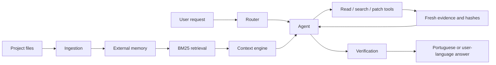
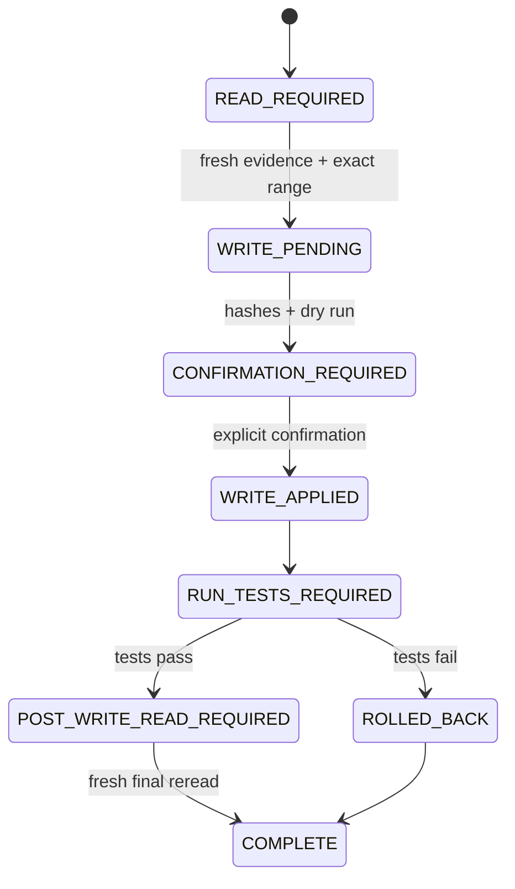

# Architecture

Eyle is a local-first coding assistant that avoids placing an entire repository
inside the model context. It stores a persistent external representation of the
project, retrieves only relevant evidence, and validates answers and edits
against fresh files on disk.

## Data flow

## Main components

- `ingest.py` scans a project and creates small searchable chunks.
- `retrieval/buscar.py` implements offline BM25 retrieval in Python.
- `engine/context_engine.py` budgets the context sent to the model.
- `engine/agent.py` runs the goal, evidence, action, and completion loop.
- `engine/agent_tools.py` defines executable tool contracts and permissions.
- `engine/agent_state.py` persists checkpoints and write-state transitions.
- `engine/codar.py` performs dry runs, atomic patches, tests, and rollback.
- `engine/sandbox.py` enforces command allowlists and isolation policy.
- `verify/validar.py` checks grounding and records warnings.
- `web/routes.py` exposes the authenticated single-user web interface.

## Write state machine

The model proposes actions, but deterministic project code owns path checks,
hashes, confirmation, patch application, tests, final reread, and rollback.

## Default supervised profile

The checked-in release configures `rollout_mode: "full"` only for projects under the repository-local `workspace/` directory. Every write requires explicit confirmation. Paths outside that allowlist are automatically downgraded to `read_only`. The minimum recommended model for this profile is **LFM2.5-8B-A1B** or a compatible quantized derivative.
