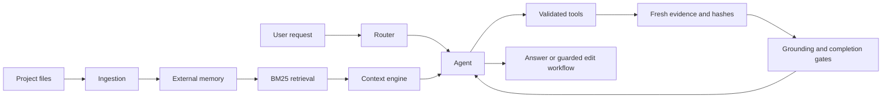
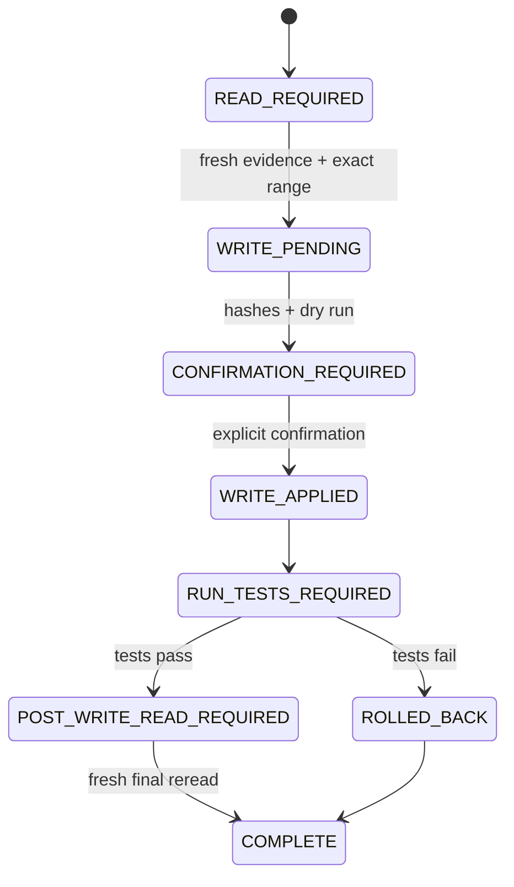

# Architecture

Eyle is a local-first coding agent that avoids placing an entire repository inside the model context. It stores an external representation of the project, retrieves only relevant evidence, and validates answers and edits against fresh files on disk.

## Data flow

## Main components

- `ingest.py` scans the project and creates searchable chunks with bounded deterministic parallelism.
- `retrieval/buscar.py` implements offline inverted-index BM25, index reuse, exact heap Top-K, and a bounded query LRU.
- `engine/context_engine.py` budgets evidence sent to the model.
- `engine/agent.py` runs the goal, evidence, action, cycle-detection, and completion loop.
- `engine/agent_tools.py` defines executable contracts, schemas, limits, and permissions.
- `engine/agent_state.py` persists checkpoints, evidence, fingerprints, and write transitions.
- `engine/grounding.py` validates claims against evidence and blocks unsupported objective anchors.
- `engine/structured_claims.py` validates atomic audit claims, renders final text, and blocks unsupported health/test-status declarations.
- `engine/codar.py` performs dry runs, atomic patches, configured tests, final reread, and rollback.
- `engine/sandbox.py` enforces command allowlists and isolation policy.
- `engine/queue.py` and `engine/worker.py` provide persistent jobs, heartbeats, bounded reservation, child-process isolation, watchdogs, and parallel consumers.
- `engine/process_limiter.py` limits LLM concurrency across threads and processes.
- `engine/telemetry.py` stores duration/status metrics and computes P50/P95/P99.
- `llm/executar.py` handles differentiated timeouts, retries, backoff, model discovery, budgets, and backend compatibility.
- `llm/cache.py` stores validated prompt responses in SQLite and rejects poisoned entries.
- `verify/validar.py` verifies citations, coverage, and grounding.
- `web/routes.py` exposes the authenticated single-user web interface.

## Project-audit conclusion pipeline

A general audit uses a deterministic inventory and candidate catalog, an initial Scout, automatic fresh reads, a gap-review Scout, and a tool-free Finalizer. The Finalizer emits atomic `claims[]`; the system validates each claim and its `evidence_ids`, renders the final text, applies global health/test-status gates, then runs typed grounding and minimum-coverage checks.

`memory/entendimento.json` is navigation memory, not live evidence. Entries are explicitly marked `UNTRUSTED_NAVIGATION_HINT` unless their stored file hash still matches disk. Even hash-verified entries do not replace fresh Evidence Registry IDs in a project-audit conclusion.

## Completion and cycle protection

A project answer is not accepted merely because the model emits `final`. Completion checks require relevant fresh evidence and valid references. Revision 53 also fingerprints material state and recent tool results to detect short periods such as `A-A`, `A-B-A-B`, and `A-B-C-A-B-C` before they consume the full task budget.

## Write state machine

The model proposes actions; deterministic state controls transitions. Configuration and trust boundaries are documented in [configuration.md](configuration.md).
